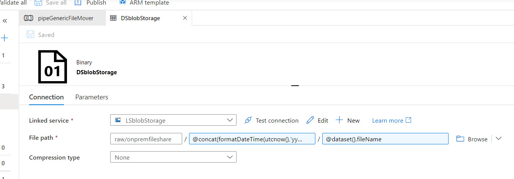

# Create an "auto-loader" to ingest from on-prem to Azure Storage

When starting any data solution in the cloud, one of the first places to start is loading the data into Azure Storage. A common task is to create a process to allow users to upload data into Azure for further downstream analysis automatically. This could be anything – Databricks, SQL, even just Power BI directly. Imagine a scenario where I have a Power BI report that refreshes from on-prem, and I want to speed up the daily refresh by simply moving the files to Azure. Today we’re going to create a generic file loader into Azure that takes whatever is copied into a file share on-prem and load it to an Azure Storage blob. The process flow looks like the below:

Pre-requisites:
* A Windows server (either on-prem or in Azure) that has a file share created with a list of files that you wish to upload and a self-hosted Integration Runtime installed
* An Azure Data Factory instance created

The pipeline consists of only a few activities: A “get Metadata” activity and a for each loop with a “Copy Data” activity.

# The Get Metadata activity
The get Metadata activity monitors the on-prem folder and retrieves a list of the child items inside the folder, as illustrated in the below screenshot:

# The For Each Loop
The child items are then passed to the for each loop container via dynamic content. On the foreach container, under Settings-> Items, add in code to tell ADF to use the list of the childItems that the Get Metadata activity returned:

'@activity('Meta OnPremFolderMonitor').output.childItems'

## Copy Data Activity
The copy data activity is where the majority of the work occurs. Using the list of child Items returned from th previous activity, the copy data loops over the list of files passed in and moves the files to Azure Storage. This involves using a source dataset, and a sink dataset. Let's configure the source dataset first.

### File Name Source Dataset
The source dataset is an on-prem file share, and contains a parameter to hold the filename being passed in from the parent object. It is a different dataset than the folder level object we previously created, as we are using it to moves files within the folder. After creating the binary dataset type for a new dataset, create a new parameter called fileName to hold the name of the file:

Under the connection screen, select the we are going to use the dataset fileName parameter we just created as the name of the file:

Once you close the connection and go back to the main Copy Data activity you should see a new parameter under dataset properties. Be sure to map it to '@item().name'. This tells the ADF For Each Loop container to use each filename from the childItems earlier in the pipeline as the value.

### Azure Storage Sink Dataset
The sink dataset should point to the azure storage container where the data will be stored within Azure. Similarly to the source dataset, we are going to use the fileName parameter to map the name of the source file the name of the file in azure storage. Create a linked service to Azure Storage and then create a parameter for the filename

On the main connection screen set the file path name to be the same as the dataset file name like we previously did. Optionally notice that for the middle I created a folder hierarchy to create different folders for the year, month, and day. This way it is nice and clean in Azure Storage and I should have both a historical record of what I did load. This helps with re-loading or querying historical data when needed. That code, if you need it, is:

'@concat(formatDateTime(utcnow(),'yyyy'),'/',formatDateTime(utcnow(),'MM'),'/',formatDateTime(utcnow(),'dd'))'

Once you close the connection and go back to the main Copy Data activity you should see a new parameter under dataset properties. Be sure to map it to '@item().name'. Similarly to the source connection, this tells ADF to use each filename from the childItems earlier in the pipeline as the value.

Saving and publishing your pipeline, then running it and you should see all of your files in Azure Storage!

